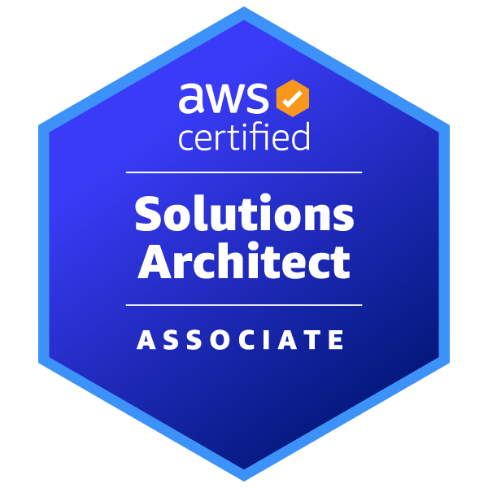

### G'day, nice to meet you! 👋

👾 I’m `huewood`, previously from **Melbourne, Australia** 🦘 now travelling the world.

# Currently Learning
- [ ] Ruby
- [ ] Hugo
- [x] Kubernetes 
- [x] ECS

# Currently studying for
- [Terraform Associate Certification](https://www.hashicorp.com/certification/terraform-associate)

# Completed certifications

  
  

# Stats
  

    
  
